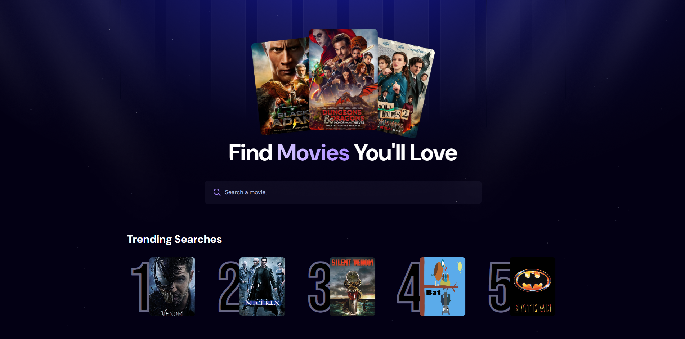
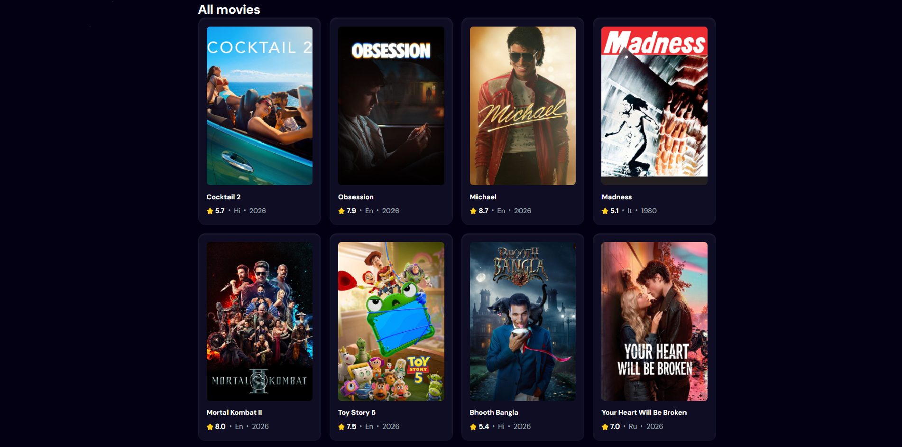

# Movie App

[](https://movie-app-one-theta-77.vercel.app/)
[](https://github.com/Daniel-S-00/Movie-app/actions/workflows/ci.yml)


A modern movie discovery app built with React, Vite, and Tailwind CSS. Search for movies, browse trending searches, and explore a curated catalog powered by [TMDB](https://www.themoviedb.org/).




## Live Demo

**https://movie-app-one-theta-77.vercel.app/**

## Features

### Search & Discovery
- Debounced real-time search (500 ms)
- Popular movies browse from TMDB
- "Load more" pagination (20 per page)
- Movie details modal with backdrop, tagline, runtime, genres, and full overview
- Recent searches history (last 5, persisted in `localStorage`)
- Trending searches from Appwrite — clickable to refill the search

### UX & Design
- Dark / light mode toggle (persisted, sun/moon icon in the top-right corner)
- Skeleton loaders during fetch
- Friendly empty-state with illustration
- Smooth fade-in on search results
- Page title syncs with the current search
- 404 page with a link back home
- Lazy-loaded poster images

### Quality & Performance
- Error boundary catches render-time crashes
- Web Vitals reporting (LCP, INP, CLS, FCP, TTFB)
- Code-split movie-details modal (separate JS chunk, only loads when opened)
- `React.memo` on movie cards to skip unnecessary re-renders
- Accessible: keyboard navigation, ARIA labels, visible focus rings, form-based search
- 38 unit and integration tests with v8 coverage

## Tech Stack

**Frontend**
- [React 19](https://react.dev/) — UI library
- [Vite 7](https://vite.dev/) — Build tool & dev server
- [Tailwind CSS 4](https://tailwindcss.com/) — Utility-first styling
- [React Router 7](https://reactrouter.com/) — Client-side routing (404 page)
- [react-use](https://github.com/streamich/react-use) — `useDebounce` hook
- [web-vitals](https://github.com/GoogleChrome/web-vitals) — Performance metrics

**APIs & Services**
- [TMDB API](https://www.themoviedb.org/documentation/api) — Movie data
- [Appwrite](https://appwrite.io/) — Backend-as-a-Service for trending-search metrics

**Tooling & Testing**
- ESLint 9 (flat config)
- Vitest 4 + React Testing Library 16 + jsdom + `@testing-library/jest-dom`
- v8 coverage reports
- Husky 9 + commitlint + lint-staged

**Deployment & DevOps**
- [Vercel](https://vercel.com/) — Hosting & auto-deploy on push to `main`
- [GitHub Actions](https://github.com/Daniel-S-00/Movie-app/actions) — CI on every push and PR (lint → test → build)

## Project Structure

```
src/
├── App.jsx                    # Main app component (composition + state)
├── main.jsx                   # Entry point (BrowserRouter + ErrorBoundary)
├── config.js                  # Validated env-var access (fails fast on missing keys)
├── reportWebVitals.js         # Web Vitals metrics collection
├── index.css                  # Tailwind theme + light-mode overrides
├── components/
│   ├── ErrorBoundary.jsx      # Catches render-time errors
│   ├── EmptyState.jsx         # Friendly "no results" UI
│   ├── Modal.jsx              # Reusable accessible modal overlay (Esc, focus trap)
│   ├── MovieCard.jsx          # Memoized movie card with click-to-select
│   ├── MovieDetails.jsx       # Lazy-loaded movie-details content
│   ├── Search.jsx             # Debounced search input (form + Enter)
│   ├── SkeletonCard.jsx       # Loading placeholder
│   └── ThemeToggle.jsx        # Dark/light mode switch
├── hooks/
│   ├── useLocalStorage.js     # Generic [value, setValue] backed by localStorage
│   ├── useMovieDetails.js     # Fetches a single movie by id (with cancellation)
│   ├── useMovies.js           # Movies state, debounce, pagination
│   ├── useRecentSearches.js   # localStorage recent searches (max 5)
│   ├── useTheme.js            # Dark/light theme with localStorage persistence
│   └── useTrendingMovies.js   # Appwrite trending fetcher
├── pages/
│   └── NotFound.jsx           # 404 page
├── services/
│   ├── appwrite.js            # Appwrite client + search-counter helpers
│   └── tmdb.js                # TMDB API wrapper (fetchMovies, fetchMovieDetails)
└── test/
    ├── setup.js               # jest-dom matchers
    ├── smoke.test.js
    ├── components/__tests__/  # MovieCard.test.jsx, Search.test.jsx
    ├── hooks/__tests__/       # useLocalStorage.test.js, useMovies.test.js
    └── services/__tests__/    # tmdb.test.js, appwrite.test.js
```

## Getting Started

### Prerequisites

- Node.js 22 (use `nvm use` to align with `.nvmrc`)
- npm
- A free [TMDB](https://www.themoviedb.org/signup) account (for the movie API)
- A free [Appwrite Cloud](https://cloud.appwrite.io/) project (for trending searches)

### 1. Clone the repository

```bash
git clone https://github.com/your-username/movie-app.git
cd movie-app
```

### 2. Install dependencies

```bash
npm install
```

This also runs `husky` automatically (via the `prepare` script) to install the local git hooks.

### 3. Configure environment variables

```bash
cp .env.example .env.local
```

See [`.env.example`](./.env.example) for all required variables.

#### Getting a TMDB API Key

1. Create an account at [themoviedb.org](https://www.themoviedb.org/signup)
2. Go to **Settings → API**
3. Copy your **API Read Access Token** (v4 auth — a long JWT string)
4. Paste it as `VITE_TMDB_API_KEY` in `.env.local`

> The TMDB Read Access Token is read-only and safe to ship to the client.

#### Setting up Appwrite

1. Create a project in the [Appwrite Console](https://cloud.appwrite.io/)
2. Create a database and a collection (e.g. `metrics`)
3. Add the following attributes to the collection:
   - `searchTerm` (string, required)
   - `count` (integer, required)
   - `movie_id` (integer)
   - `poster_url` (string)
4. Set collection permissions to allow client-side **create**, **read**, and **update**
5. In **Platforms**, add both:
   - `localhost` (for development)
   - your production domain (e.g. `movie-app-one-theta-77.vercel.app`)
6. Copy the **Project ID**, **Endpoint**, **Database ID**, and **Collection ID** into `.env.local`

### 4. Run the dev server

```bash
npm run dev
```

Open [http://localhost:5173](http://localhost:5173).

## Available Scripts

| Command                  | Description                                |
| ------------------------ | ------------------------------------------ |
| `npm run dev`            | Start the Vite dev server                  |
| `npm run build`          | Build for production                       |
| `npm run preview`        | Preview the production build locally       |
| `npm run lint`           | Run ESLint                                 |
| `npm run test`           | Run tests in watch mode                    |
| `npm run test:run`       | Run tests once (CI-friendly)               |
| `npm run test:coverage`  | Run tests and produce a coverage report    |

## Testing

The project ships with **38 unit and integration tests** that run automatically on every push and PR via GitHub Actions. Tests are written with Vitest and React Testing Library.

What's covered:

| Area        | What's tested                                                                                  |
| ----------- | ---------------------------------------------------------------------------------------------- |
| Hooks       | `useLocalStorage` (init / read / write / object values / parse error); `useMovies` (fetch / debounce / `updateSearchCount` / error handling / `loadMore`) |
| Components  | `MovieCard` (render / fallback / N/A placeholders / click / Enter / a11y); `Search` (value / typing / form role / a11y / no-reload submit) |
| Services    | `tmdb` (discover / search / encoded query / non-ok / empty fallback; `fetchMovieDetails` URL and error); `appwrite` (create vs increment / order+limit / error swallow) |

Coverage on the two service modules is **100 %**; the tested hooks and components sit at **91–100 %**.

Run locally:

```bash
npm run test:run          # single run
npm run test:coverage     # with v8 coverage report
```

## Development Workflow

This project enforces **Conventional Commits** via [commitlint](https://github.com/conventional-changelog/commitlint) and a Husky `commit-msg` hook. A pre-commit hook runs `eslint --fix` on staged `*.{js,jsx}` files via [lint-staged](https://github.com/okonet/lint-staged) — so every commit lands lint-clean and message-conformant.

Pushes to `main` and pull requests trigger a GitHub Actions workflow (`.github/workflows/ci.yml`) that runs `npm run lint`, `npm run test:run`, and `npm run build`.

## Deployment

Hosted on [Vercel](https://vercel.com/) with automatic CI/CD:

- **Push to `main`** → production build & deploy (via Vercel)
- **Pull requests** → preview deployments per PR
- **Every push / PR** → GitHub Actions runs lint + test + build

To deploy your own fork:

1. Import the repo into Vercel
2. Add the same environment variables from `.env.local` in **Project Settings → Environment Variables**
3. Deploy

## Security Notes

- All API keys are read-only and exposed by design (TMDB Read Access Token + Appwrite project keys with restricted permissions)
- Appwrite platform restrictions are configured to accept requests from `localhost` and the production domain only
- `.env.local` is gitignored — **never commit your `.env` files**

## License

This project is licensed under the [MIT License](./LICENSE).

## Acknowledgments

- Movie data from [The Movie Database (TMDB)](https://www.themoviedb.org/). This product uses the TMDB API but is not endorsed or certified by TMDB.
- Inspired by the [JavaScript Mastery](https://www.javascriptmastery.com/) tutorial
